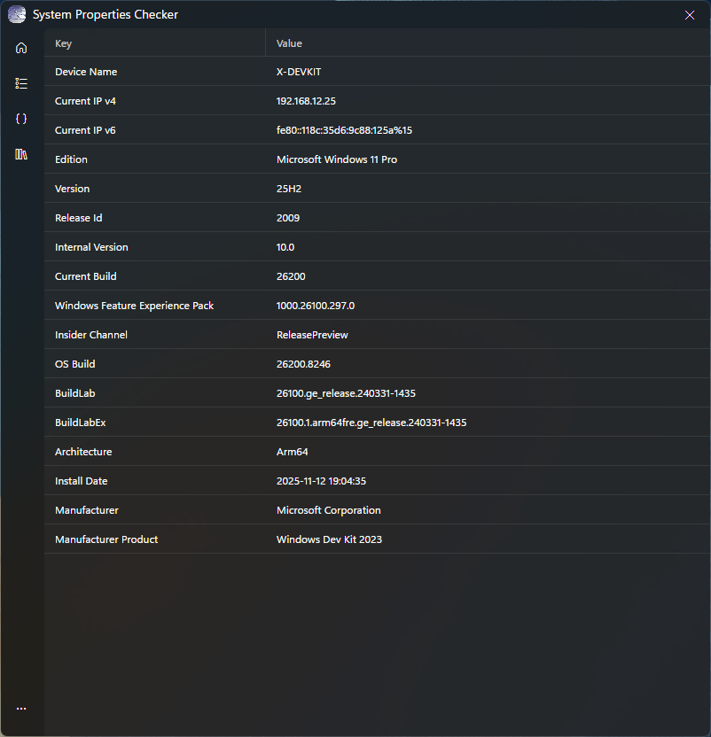
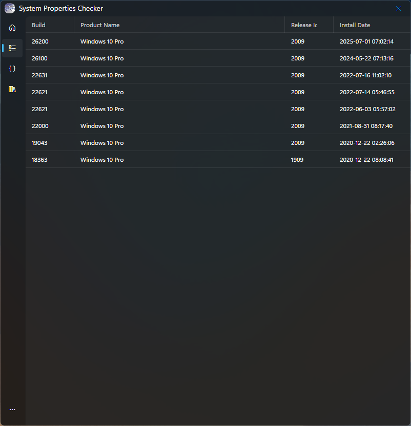
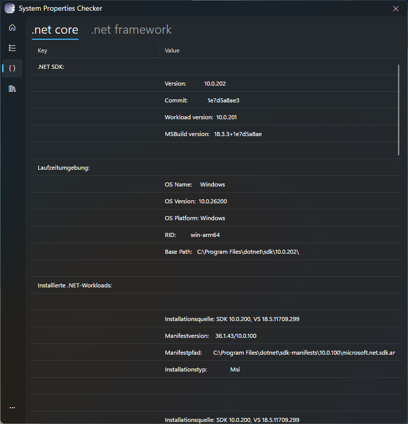
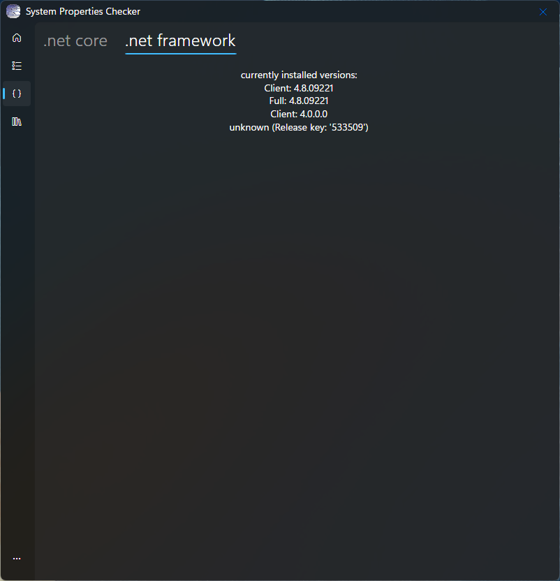
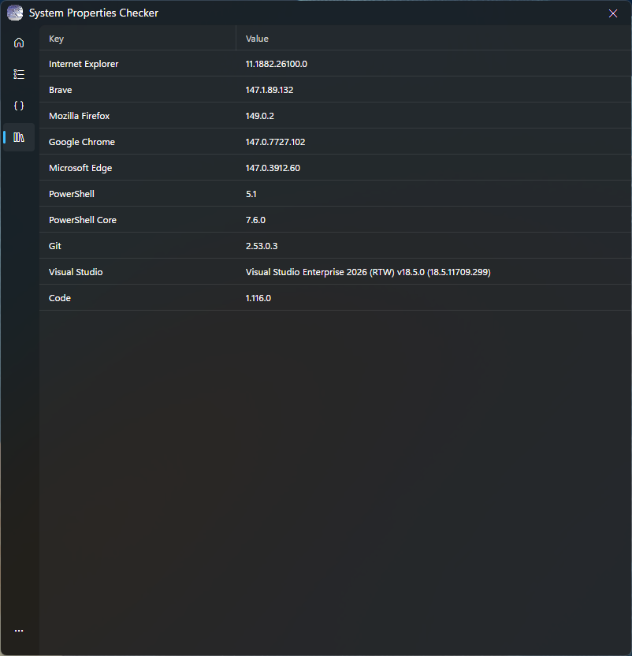

#  SystemPropertiesChecker

## About
some little tool I wrote to get quick information about installed service packs on windows. Since Windows 7 SP1 was the last one of those service packs, I decided to extend the functionality to display installed .Net frameworks and other software.

## `Basic` View
Gives information regarding device name, current IP, and the windows information used

## `History` View
List of former installed versions / builds of windows

## `.net` View
Reads global.json to list installed .net (core) runtimes and SDKs

## `.net framework` View
Reads the windows registry to list installed / activated .net framework versions

## `other` View
Lists installed browsers and some other tools, such as Git for Windows or PowerShell

