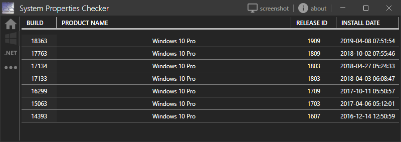
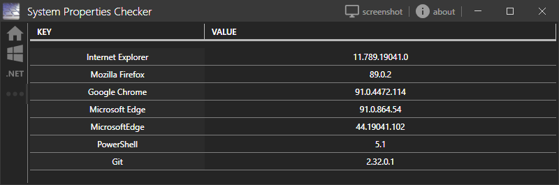

#  SystemPropertiesChecker

## About

some little tool I wrote to get quick information about installed service packs on windows. Since Windows 7 SP1 was the last one of those service packs, I decided to extend the functionality to display installed .Net frameworks and other software.

## 'Basic' tab

Gives information regarding device name, current IP, and the windows information used

## 'History' tab

List of former installed versions / builds of windows

## '.net core' tab

Reads global.json to list installed .net (core) runtimes and SDKs

## '.net framework' tab

Reads the windows registry to list installed / activated .net framework versions

## 'other' tab

Lists installed browsers and some other tools, such as Git for Windows or PowerShell (Core is not implemented)

