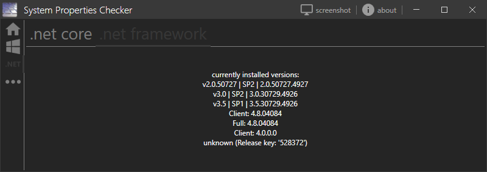
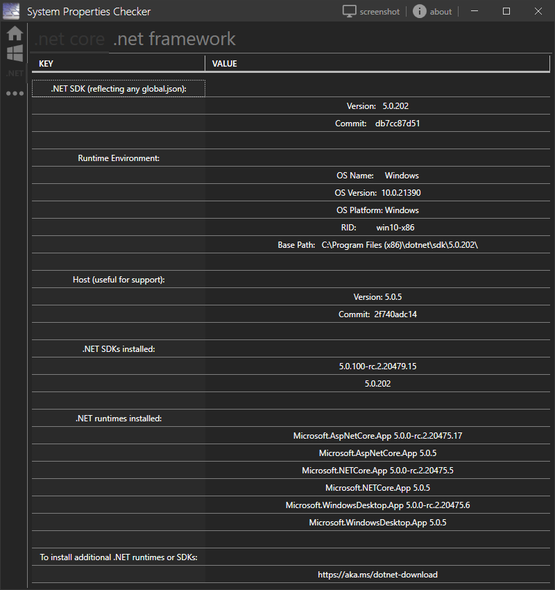

 SystemPropertiesChecker
==========

some little tool I wrote to get a quick information about installed service packs on windows. Since Windows 7 SP1 was the last one of these service packs, I decided to extend the functionality to display installed .Net frameworks and other software.

